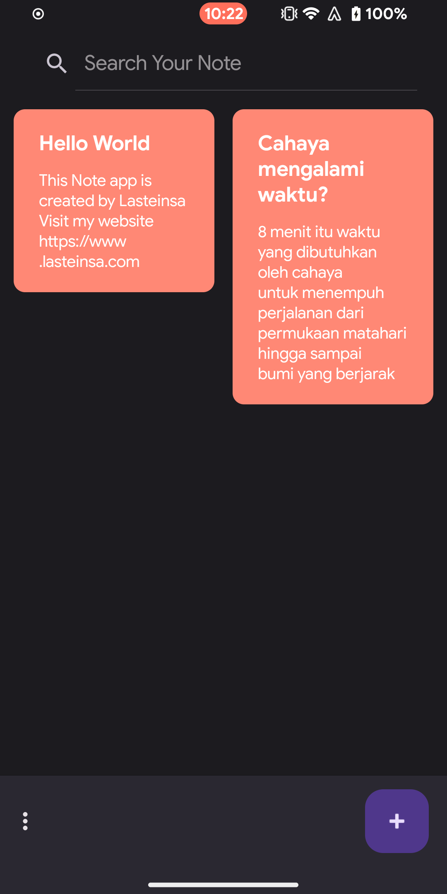
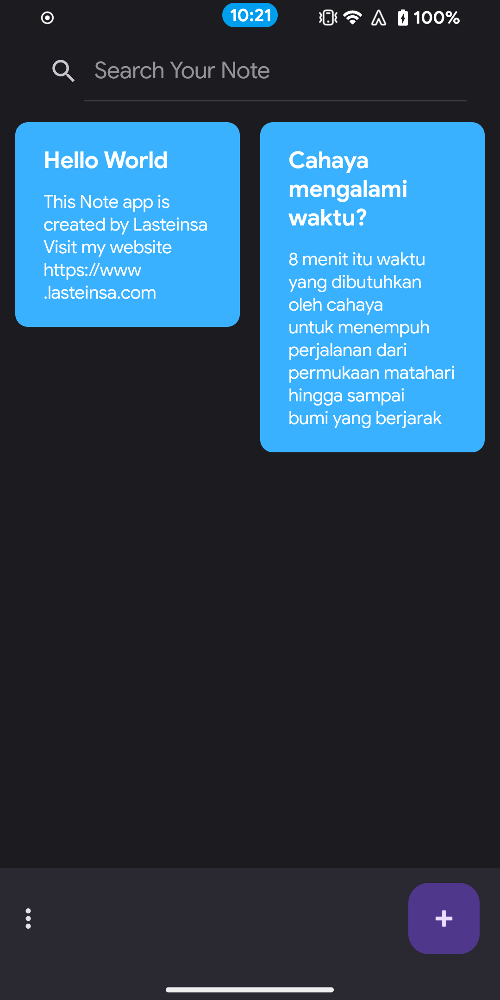
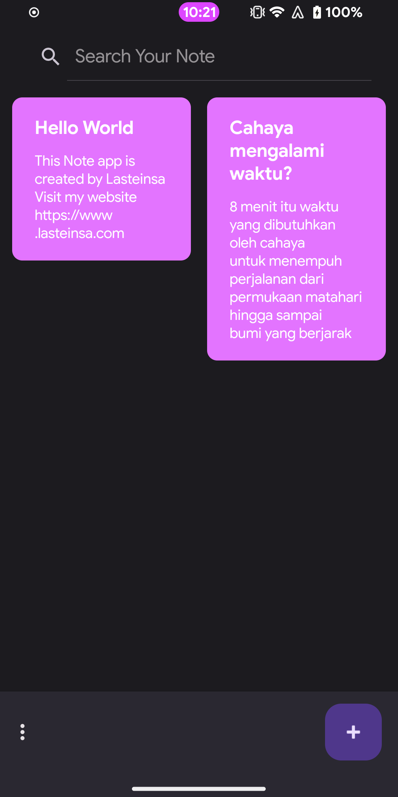

## Simple Note App Material You

Simple app with less feature to focus on create, update, and delete

### Features
- Create Note
- Update Note
- Delete Note
- Search Note
- Select Note
- Initial Theme Follow System
- Set Theme

### Screenshoot

### Tools & Technology used

  

#### Implemented
1. MVVM Pattern
2. Material You
3. Recyclerview
4. Dagger Hilt Dependency Injection
5. Kotlin Coroutine Flow 
6. Room with prepopulated 
7. Clean Architecture
8. Modularization
9. etc.
